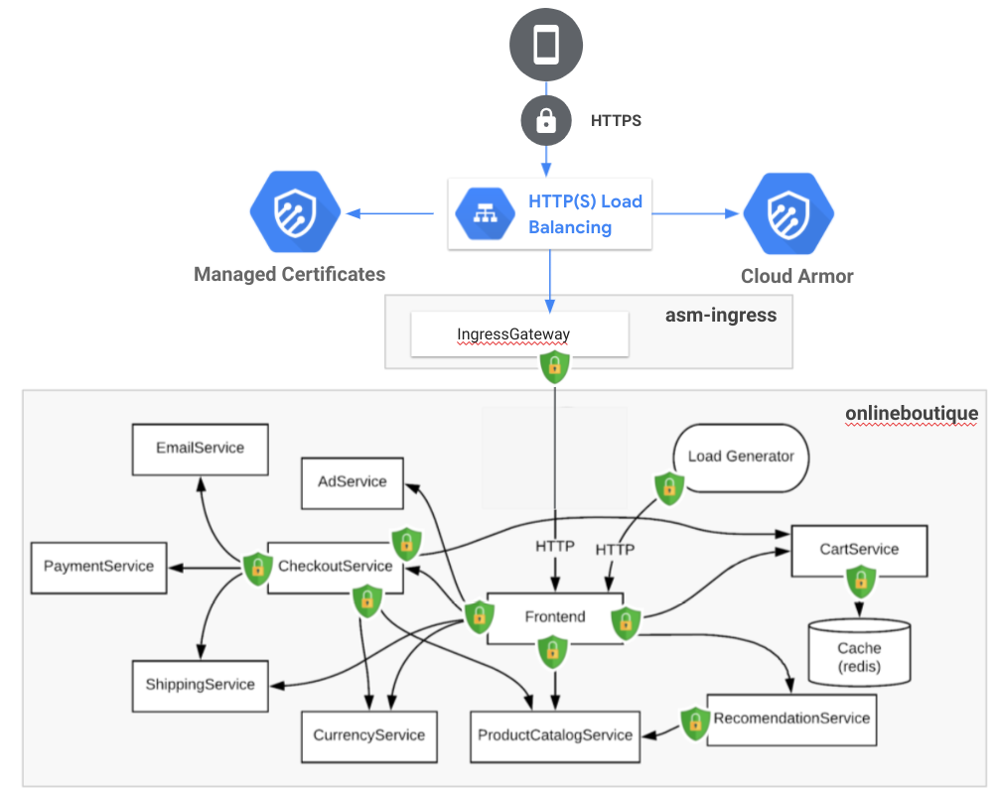

Even if I already covered how to [protect your service mesh with an HTTPS GCLB and Cloud Armor](), I thought I will describe in more details what are your other options to protect your workloads on GKE thanks to Anthos Service Mesh (ASM).

Here are 5 easy steps to accomplish this:
1. Install ASM on your cluster
2. Enable ASM for your apps
3. Enable mTLS `STRICT` for your apps
4. Define `AuthorizationPolicies` for your apps
5. Leverage an HTTPS GCLB and Cloud Armor in front of your `IngressGateway`

Let's see those in actions.

## Install ASM on your cluster

[Anthos Service Mesh](https://cloud.google.com/service-mesh/docs/overview) has a suite of features and tools that help you observe and manage secure, reliable services in a unified way.

```
asmcli install \
    --project_id $projectId \
    --cluster_name $clusterName \
    --cluster_location $zone \
    --enable-all \
    --option cni-gcp
```

_Note: Using `--option cni-gcp` is giving you more security because the [Istio CNI](https://istio.io/latest/docs/setup/additional-setup/cni/) plugin replaces the functionality provided by the `istio-init` container (which has elevated permissions)._

## Enable ASM for your apps

In order to take advantage of all of ASM/Istio’s features, pods in the mesh must be running an ASM [sidecar proxy](https://istio.io/latest/docs/setup/additional-setup/sidecar-injection/).

```
namespace=onlineboutique
asmRevision=asm-1112-17
kubectl label namespace $namespace \
    istio-injection- istio.io/rev=$asmRevision \
    --overwrite
```

To actually inject the sidecar proxy, we need to force a deployment of your apps on this specific namespace:
```
kubectl rollout restart deployments -n $namespace
```

## Enable mTLS `STRICT` within that namespace

Istio [`PeerAuthentication`](https://istio.io/latest/docs/reference/config/security/peer_authentication/) defines how traffic will be tunneled (or not) to the sidecar.

```
cat <<EOF | kubectl apply -n $namespace -f -
apiVersion: security.istio.io/v1beta1
kind: PeerAuthentication
metadata:
 name: default
spec:
 mtls:
   mode: STRICT
EOF
```

## Define `AuthorizationPolicies`

Istio [`AuthorizationPolicy`](https://istio.io/latest/docs/reference/config/security/authorization-policy/) enables access control on workloads in the mesh.

First, we need to deny all the ingress traffic to any pod in that namespace:

```
cat <<EOF | kubectl apply -n $namespace -f -
apiVersion: security.istio.io/v1beta1
kind: AuthorizationPolicy
metadata:
  name: deny-all
spec:
  {}
EOF
```

Then, we need to granularly give access to certain pods to communicate between each others, only where needed. The following example gives both `frontend` and `checkoutservice` to reach out to `cartservice` only on specific operations:

```
cat <<EOF | kubectl apply -n $namespace -f -
apiVersion: security.istio.io/v1beta1
kind: AuthorizationPolicy
metadata:
  name: cartservice
spec:
  selector:
    matchLabels:
      app: cartservice
  rules:
  - from:
    - source:
        principals: ["cluster.local/ns/onlineboutique/sa/frontend", "cluster.local/ns/onlineboutique/sa/checkoutservice"]
    to:
      - operation:
          paths: ["/hipstershop.CartService/AddItem", "/hipstershop.CartService/GetCart", "/hipstershop.CartService/EmptyCart"]
          methods: ["POST"]
EOF
```

You could see that we identify the sources with a specific `ServiceAccount` for each pod/app. You could find other `AuthorizationPolicy` and `ServiceAccount` definitions for each app of the OnlineBoutique [in there](https://github.com/mathieu-benoit/my-kubernetes-deployments/tree/main/namespaces/onlineboutique).

## Leverage an HTTPS GCLB and Cloud Armor in front of your `IngressGateway`

To start let's create a Cloud Armor policy:
```
policyName=asm-ingressgateway
gcloud compute security-policies create $policyName \
    --description "Block XSS attacks"
gcloud compute security-policies rules create 1000 \
    --security-policy $policyName \
    --expression "evaluatePreconfiguredExpr('xss-stable')" \
    --action "deny-403" \
    --description "XSS attack filtering"
```

Then, let's create a public static IP address:
```
ipName=asm-ingressgateway
gcloud compute addresses create $ipName --global
ipAddress=$(gcloud compute addresses describe $ipName --global --format=json | jq -r '.address')
echo $ipAddress
```

From here, you could bring your own DNS and set the IP address provisioned previously, or you could run the following commands to get a DNS from Cloud Endpoint (this is needed to provision the `ManagedCertificate` soon):
```
projectId=FIXME
hostName=onlineboutique.endpoints.$projectId.cloud.goog
cat <<EOF > dns-spec.yaml
swagger: "2.0"
info:
  description: "Cloud Endpoints DNS"
  title: "Cloud Endpoints DNS"
  version: "1.0.0"
paths: {}
host: "${hostName}"
x-google-endpoints:
- name: "${hostName}"
  target: "${ipAddress}"
EOF
gcloud endpoints services deploy dns-spec.yaml
```

Finally, we could now deploy our [Kubernetes manifest](https://gist.github.com/mathieu-benoit/19c020c9a1cbe19e0541316502358f91) containing all the object needed to deploy our ingress gateway (`Deployment`, `Service`, `Ingress`, `BackendConfig` and `ManagedCertificate`):
```
ingressNamespace=asm-ingress
kubectl create ns $ingressNamespace
kubectl label namespace $ingressNamespace istio-injection- istio.io/rev=$asmRevision --overwrite
curl https://gist.githubusercontent.com/mathieu-benoit/19c020c9a1cbe19e0541316502358f91/raw/619478e78e6234718d86e990bcf402270386aef0/asm-ingress.yaml > asm-ingress.yaml
sed -i "s,SECURITY_POLICY,${policyName},g;s,HOST_NAME,${hostName},g;s,IP_NAME,${ipName},g" asm-ingress.yaml
kubectl apply -n $ingressNamespace -f asm-ingress.yaml
```

After waiting for a couple of minutes, all the infrastructure will be provisioned and you should be able to reach your DNS (i.e. https://$hostName) successfully, on a secure manner ;)

_Note: there is two other scenario you could leverage by exposing your `IngressGateway`, either via an [internal load balancer](https://cloud.google.com/service-mesh/docs/unified-install/options/enable-optional-features#enable_an_internal_load_balancer) or even via a [private service connect](https://cloud.google.com/kubernetes-engine/docs/how-to/internal-load-balancing#ilb_psc), if you don't want to expose your apps publicly._


And voila, that's a wrap!

Ultimately, here is the secure setup we have been describing with this blog article, the OnlineBoutique demo is now more secured. Hope you will be able to leverage this for your own apps/setup.



Hope you enjoyed that one, stay safe out there! ;)